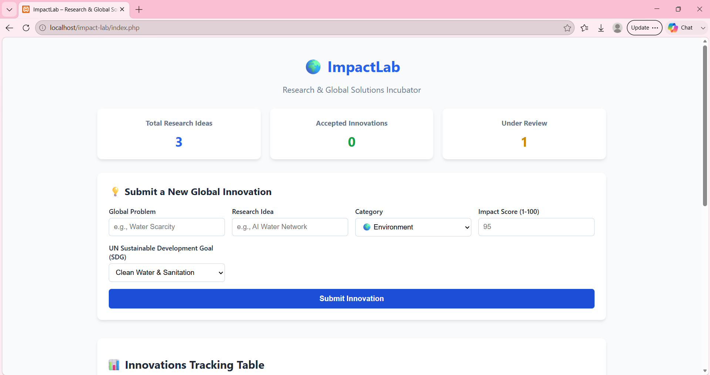
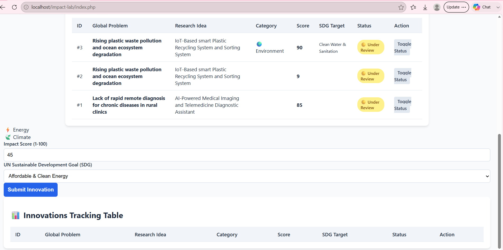

# 🌍 ImpactLab – Research & Global Solutions Incubator

ImpactLab is a web-based research and innovation management platform designed to organize global challenges, research ideas, proposed solutions, and their potential impact in one structured system.

The platform provides a simple and organized environment for documenting innovative ideas, tracking their status, and storing structured research data using MySQL.

---

##  Overview

ImpactLab was developed to provide a lightweight and organized environment for managing research-driven solutions to real-world problems.

The platform allows users to:

- Document global problems and challenges
- Record proposed research ideas and innovative solutions
- Assign and track impact scores
- Monitor the status of research entries
- Store and retrieve structured data through MySQL
- Manage research information through a clean web interface

---

## ✨ Key Features

### 💡 Innovation Management

Create and store new research and innovation entries containing:

- Global problem
- Proposed research idea
- Potential solution
- Impact score
- Current status

### 📊 Dynamic Data Management

Research entries are stored in a MySQL database and dynamically retrieved through the PHP backend.

### 🎯 Impact Tracking

Each innovation can be assigned an impact score and tracked throughout its development lifecycle.

### 📋 Status Management

Research ideas can be categorized according to their current progress or status.

### 🎨 Clean User Interface

The interface is built with Bootstrap 5 to provide a structured, responsive, and professional experience.

---

## 🏗️ System Architecture

```text
                         ┌──────────────────────┐
                         │        User          │
                         └──────────┬───────────┘
                                    │
                                    ▼
                         ┌──────────────────────┐
                         │    Web Interface     │
                         │ HTML5 / CSS3 / BS5   │
                         └──────────┬───────────┘
                                    │
                                    ▼
                         ┌──────────────────────┐
                         │     PHP Backend      │
                         │ Application Logic    │
                         └──────────┬───────────┘
                                    │
                                    ▼
                         ┌──────────────────────┐
                         │   MySQL Database     │
                         │  Research & Ideas    │
                         └──────────────────────┘
```
---


🛠️ Technology Stack
Layer
Technology
Frontend
HTML5, CSS3
UI Framework
Bootstrap 5
Backend
PHP
Database
MySQL
Local Development
XAMPP
Database Management
phpMyAdmin
Remote Sharing
ngrok
Version Control
Git / GitHub


---


📁 Project Structure
ImpactLab/
│
├── index.php
│   └── Main dashboard and user interface
│
├── db.php
│   └── MySQL database connection configuration
│
├── add_innovation.php
│   └── Processes new innovation submissions
│
├── impactlab.png
│   └── Platform interface screenshot
│
└── Innovation DataBase.png
    └── Database structure screenshot


---

## 📸 Visual Walkthrough

### Platform Interface

<p align="center">
  
  
</p>

### Database Structure

The MySQL database stores the structured information required by the platform, including research problems, ideas, impact scores, and statuses.

<p align="center">
  
</p>

---


⚙️ Installation & Setup
1. Clone the Repository
git clone <YOUR-GITHUB-REPOSITORY-URL>
cd ImpactLab
Alternatively, download the repository as a ZIP file.

2. Move the Project to XAMPP
Copy the project folder into:
C:\xampp\htdocs\
The final structure should be:
C:\xampp\htdocs\ImpactLab\

3. Start XAMPP
Open the XAMPP Control Panel and start:
Apache
MySQL

4. Create the Database
Open phpMyAdmin:
http://localhost/phpmyadmin
Create a new database named:
innovations
Make sure the database tables and columns match the queries used by the PHP files.

5. Configure the Database Connection
Open:
db.php
Configure the MySQL connection according to your local environment.
Example:
<?php

$conn = new mysqli(
    "localhost",
    "root",
    "",
    "innovations"
);

if ($conn->connect_error) {
    die("Database connection failed: " . $conn->connect_error);
}

?>
Security Note: Never commit real production database credentials or passwords to GitHub.


6. Run the Application
Open your browser and navigate to:
http://localhost/ImpactLab/
The ImpactLab dashboard should now be available locally.


---


🌐 Sharing the Application Temporarily
For demonstrations and presentations, the application can be exposed temporarily through ngrok without deploying the PHP/MySQL application to a public hosting provider.
With Apache running on port 80, run:
ngrok http 80
ngrok will generate a temporary public HTTPS URL that can be used to access the local application remotely.
Architecture with ngrok
```text

                     Internet
                        │
                        ▼
              ┌──────────────────┐
              │  ngrok HTTPS URL │
              └────────┬─────────┘
                       │
                       ▼
              ┌──────────────────┐
              │ Local Apache     │
              │ Server :80       │
              └────────┬─────────┘
                       │
                       ▼
              ┌──────────────────┐
              │ PHP Application  │
              └────────┬─────────┘
                       │
                       ▼
              ┌──────────────────┐
              │ MySQL Database   │
              └──────────────────┘
This approach is intended for development, testing, and demonstrations. It is not a replacement for production hosting.
```
---


🧩 Technical Challenges & Solutions
Challenge 1 — Free Hosting & Database Restrictions
Problem
Free hosting environments introduced limitations around MySQL databases, database naming, permissions, and configuration. These restrictions caused compatibility and database connection issues during deployment.
Solution
The project was maintained in a controlled local XAMPP environment where Apache, PHP, and MySQL could be configured directly. This provided a more reliable development and testing environment.

---


Challenge 2 — Remote Demonstration
Problem
The application needed to be demonstrated remotely without introducing additional hosting configuration issues.
Solution
ngrok was used as a temporary HTTPS tunnel between the local Apache server and the public internet.
This allowed the application to remain locally hosted while still being accessible during demonstrations.

---

🔐 Security Considerations
Although ImpactLab is primarily an academic and portfolio project, several security practices should be considered before production deployment:
Store database credentials in environment variables or secure configuration.
Never commit passwords or API keys to GitHub.
Use prepared SQL statements to reduce SQL injection risks.
Validate and sanitize user input.
Restrict database permissions according to the application’s requirements.
Use HTTPS for production deployments.
Disable unnecessary database exposure to the public internet.


---


🚀 Future Improvements
Potential future development directions include:
🔐 User authentication and authorization
👤 Researcher profiles
📊 Advanced impact analytics and dashboards
🔎 Search and filtering capabilities
🏷️ Research categories and tags
📈 Innovation progress visualization
📝 Detailed research documentation
🌐 Production cloud deployment
🔌 REST API integration
🤖 AI-assisted research and idea evaluation
📱 Improved mobile responsiveness


---

🎯 Project Goals
ImpactLab aims to demonstrate how software engineering and structured data management can be applied to organize research and innovation around real-world global challenges.
The project combines:
Research + Technology + Data + Innovation + Social Impact
into a single platform.


---


📚 Learning Outcomes
Through the development of ImpactLab, the project demonstrates practical experience with:
PHP web development
MySQL database design
CRUD-oriented application logic
Frontend development
Bootstrap-based UI design
Database connectivity
Local server configuration
Git and GitHub workflows
Debugging deployment issues
Remote application testing


--


📄 License
This project is available for academic, educational, and portfolio purposes.


---


👩‍💻 Author
Manar  Al-Qathami
Computer Engineer

